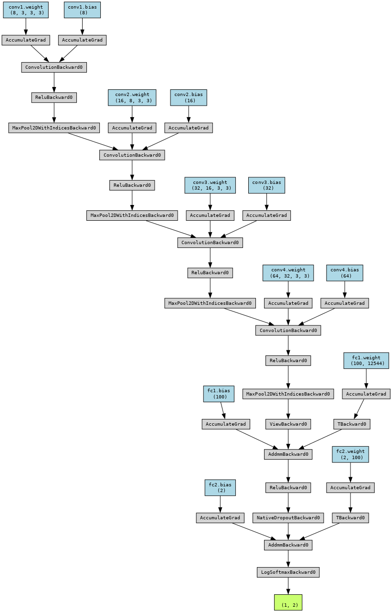

**Convolutional Neural Network for Brain Tumor Detection and Diagnosis (Pytorch, F1-score: 0.97)**

* 

This repository provides a solution for detecting brain tumors from MRI images using Convolutional Neural Networks (CNN) in PyTorch. The goal is to classify brain tumors as either benign or malignant, which is crucial for early diagnosis and treatment.

## Project Contents

- **`LICENSE`**: Contains the license for this repository (MIT License).
- **`Presentation.pdf`**: A presentation file that explains the model and its implementation.
- **`README.md`**: This file, providing an overview of the project.
- **`brain-tumor-detection-by-cnn-pytorch.ipynb`**: Jupyter notebook for implementing and training the CNN model for brain tumor detection.
- **`cnn_model_visualization.png`**: Visualization of the architecture of the CNN model.
- **`requirements.txt`**: Required Python libraries and dependencies for running the project.

## Dataset

The model is trained on a dataset of brain MRI images. The images are labeled as benign or malignant, which are used to train the deep learning model for classification.

## Model Architecture

The model uses a Convolutional Neural Network (CNN) with several convolutional layers followed by fully connected layers. This architecture is designed to automatically extract features from MRI images and classify them into benign or malignant categories.

## Installation

1. Clone the repository:

    ```bash
    git clone https://github.com/P-Darabi/Brain-Tumor-Detection.git
    cd Brain-Tumor-Detection
    ```

2. Install the required dependencies:

    ```bash
    pip install -r requirements.txt
    ```

## Usage

### Jupyter Notebook

You can explore and experiment with the model in the Jupyter notebook:

```bash
jupyter notebook brain-tumor-detection-by-cnn-pytorch.ipynb
```

## Model Visualization

Here is a visualization of the CNN model architecture:



## Contributing

Contributions are welcome! Feel free to fork the repository, make changes, and submit a pull request.

## License

This project is licensed under the MIT License. See the [LICENSE](LICENSE) file for details.

---
